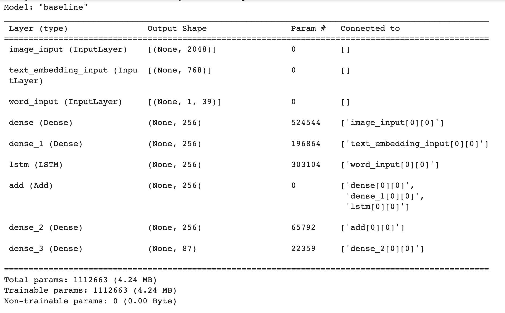
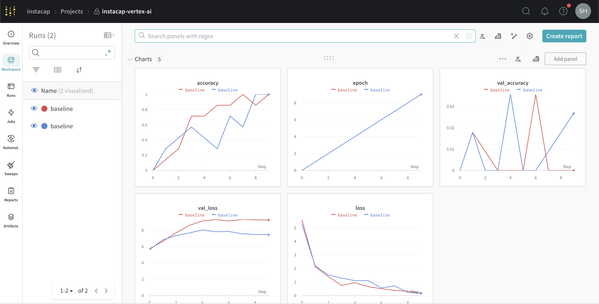

# AC215 Project: InstaCap

## Team Members
- Isha Vaish (ishavaish@g.harvard.edu)
- Danhee Kim (sharonkim@g.harvard.edu)
- Annabel Yim (annabelyim@g.harvard.edu)
- Haoran Zhang (haoran_zhang@g.harvard.edu)
- Mike Binkowski (mbinkowski@college.harvard.edu)

## Project
The goal of this project is to develop an application for Instagram caption generation. A user can upload a post they would like to caption along with a tone (e.g. quirky, funny, serious, happy, etc) for the caption.  
  
A brief outline of our project is given below (subject to change)
1. Deploy BLIP and LLaMA utilizing custom Docker containers
2. Use BLIP to generate transcriptions of a user uploaded image
3. Prompt engineer LLaMA to create Instagram-like captions based off the BLIP transcriptions and a specified tone
4. Create frontend web app UI


# Milestone 5

The current structure of our repo is given below.

## Project Organization
------------
      ├── LICENSE
      ├── README.md
      ├── notebooks
          ├── baseline_modeling.ipynb
          ├── blip_finetune.ipynb
      ├── references
      └── src
            ├── api-service
                ├── api
                    ├── service.py
            ├── blip-model
                ├── app.py
                ├── Dockerfile
                ├── requirements.txt
                ├── test_example.py
            ├── cli
                ├── cli.py
                ├── docker-shell.sh
                ├── Dockerfile
                ├── requirements.txt
            ├── frontend-simple
                ├── index.html
            ├── llama-3b-v2
                ├── app.py
                ├── Dockerfile
                ├── requirements.txt
            ├── persistant-folder
            ├── secrets
            ├── preprocessing
                ├── Dockerfile
                ├── docker-shell.sh
                ├── Pipfile
                ├── Pipfile.lock
                ├── preprocess.py
                ├── test_bucket_access.py
                ├── get_usernames.py
                ├── get_data.py
                └── create_dataset.py
            ├── data-versioning
                ├── Dockerfile
                ├── docker-shell.sh
                ├── download_data.py
                ├── Pipfile
                ├── Pipfile.lock
                ├── prep.sh
            ├── model-training
                ├── package
                    ├── trainer
                        ├── __init__.py
                        ├── task.py
                    ├── setup.py
                ├── Dockerfile
                ├── docker-shell.sh
                ├── docker-entrypoint.sh
                ├── package-trainer.sh
                ├── cli.sh
                ├── cli-multi-gpu.sh
                ├── Pipfile
                ├── Pipfile.lock
                   
--------
Note: The `persistant-folder` and `secrets` are folders that are in the local directory (not pushed to GitHub). The `notebooks` folder contains code that is not part of any containers (e.g. EDA, reports, etc) and the `references` folder contains references. Currently, we have two `.ipynb` notebooks in our `notebooks` folder related to initial modeling experimentation (finetuning BLIP, creating/training our custom model).


## Deploying LLaMA and BLIP on vertex AI with a Custom Docker Container

We take the following steps to deploy LLaMA and BLIP on vertex AI with a custom Docker container

```
[project_name]: ac215-project-398320

BLIP
[image_name]: blip-vertexai-img:latest 
[region]: us-central1
[display_name]: blip-vertexai-1

LLaMA
[image_name]: llama2-3b-vertexai-img:latest 
[region]: us-east1
[display_name]: llama2-3b-vertexai-1 
```

**1. Build and tag Docker image using custom container**

```
docker build -t gcr.io/[project_name]/[image_name] .
```

**2. Push image to Google Cloud Container Registry (GCR)**

```
docker push gcr.io/[project_name]/[image_name]
```

**3. Build a model using the image on GCR**

```
gcloud beta ai models upload \
--region=[region] \ 
--display-name=[display_name] \ 
--container-image-uri=gcr.io/[project_name]/[image_name] \
--format="get(model)"
```

**4. Deploy the model to the endpoint using Vertex AI UI** \
Navigate to Model Registry and click on ```DEPLOY AND TEST``` to deploy the model. 

## API Service
**Container Overview**:
- For test usage to generate captions based on an image that exists in your directory

**Container Files**:
1. `src/api-service/Dockerfile` - This Dockerfile is based on the official Debian-hosted Python 3.8 slim image. It sets the locale to UTF-8, updates the system, installs necessary dependencies, creates a non-root user and sets the working directory to `/app`. It then copies and installs Python packages from `requirements.txt` and finally adds the source code to the `/app` directory. The container starts with the `bash` command as the entry point. 
2. `src/api-service/docker-shell.sh` - This shell script sets environment variables, builds a Docker image named `instacap-api-service` based on our Dockerfile, and then runs a Docker container with certain environment variables and mounted volumes. After running the container, it activates a virtual environment using `pipenv shell` within the container.
3. `src/api-service/Pipfile` - This file specifies the Python package dependencies with their respective versions for our Docker container.
4. `src/api-service/api/service.py` - This Python script creates a Fast API endpoint to generate captions by processessing images and generating captions based on BLIP and LLaMA. The generate_caption endpoint takes in two arguments: the image file path (must be a jpeg) and a one-word tone. The script then processes the image, sends it to the deployed BLIP model for image transcription, and uses the result as a prompt to the deployed LlaMA model to generate an Instagram caption. The script handles authentication, model requests, and error handling, providing users with generated captions for their images. It then sends a response back with the caption.

**Demo**: \
We first build our Docker image by running the shell script.
```
sh docker-shell.sh
```
Once we run our container, we host our api service on port 900 with the following command
```
uvicorn api.service:app --host 0.0.0.0 --port 9000
```


6. ## Frontend-simple
**Container Overview**:
- This container makes a simple front end where users can select an image from their file system and generate a caption for it.

**Container Files**:
1. `src/frontend-simple/Dockerfile` - This Dockerfile is based on the official Debian-hosted Python 3.8 slim image. It updates the system, installs necessary dependencies like http-server, creates a non-root user and exposes port 8080. Finally, it adds the source code to the `/app` directory. The container starts with the `bash` command as the entry point.
2. `src/frontend-simple/docker-shell.sh` - This shell script sets environment variables and builds a Docker image named `instacap-frontend-simple` based on our Dockerfile and runs the container with our image name
3. `src/frontend-simple/index.html` - This html file is our main page for our app. It uses google style sheets and html to make a home page complete with an area to select and see a photo, input a tone, and a button to generate a caption. The javascript in this files hits our api service to get the caption.  

**Demo**: \
We first build our Docker image by running the shell script.
```
sh docker-shell.sh
```
Once we run our container, we run our file on port 8080 with the following command
```
http-server
```

With all our containers up and running, a user can then select an image, type in a tone, and get a caption!!


## Previous work on custom generative text model

Our original plan was to finetune BLIP with webscraped Instagram posts and captions. However, we believe that this approach is unncessary given the nature of how Instagram captions often do not directly describe what happens in an Instagram post (the data we scraped seem to have support this assumption of unrelated captions with images).

We decided to try a different approach in the milestone where we built a model from scratch utilizing RESNET (to extract image features) and BERT embeddings of BLIP transcriptions (to enrich our data/context/input). These two input layers along with the input sequences of the true captions (first $n$ words of the caption) are then added and passed into an LSTM layer in order to predict the $n+1$ th word of a caption. During time of inference, the model will generate captions in a loop predicting the next word while passing in the previous generated sequence as an input, the predicted image features from RESNET, and BERT embeddings of predicted BLIP transcriptions.

Below is our baseline model summary:


Our initial experimentation of this model is poor due to a small and low quality dataset.

In order to generate higher quality captions, we are deciding to shift the scope of our project: we will utilize BLIP and prompt engineer LLaMA for Instagram caption generations. In future milestones, we will be focusing on hosting BLIP and LLaMA as well as creating a user friendly UI for this application.

This milestone contains our efforts in the following:
- Finetuning BLIP attempts
- Complete scripts for scraping Instagram posts/captions that upload into GCS
- Creating the model from scratch
- Attempts for serverless training with Vertex AI
- DVC implementation

Additionally, our quota request for GPU access has not been approved. The following materials submitted in our milestone are for CPU jobs. We have been able to successfully create serverless jobs with CPU and WandB integration.


### Preprocessing

**Container Overview**:
- Web-scrapes Instagram posts and captions for different users
- Preprocesses the scraped data into the desired format
- Stores the processed data to GCP
- Input to this container is source and destination is the GCS location
- Output from this container stored at the GCS location
- `secrets` folder is needed with the Google Application Credentials json stored inside
- `persistent-folder` is a temporary folder used to verify access to the GCP bucket

**Container Files**:
1. `src/preprocessing/Dockerfile` - This dockerfile sets up a Docker container for a python application. It uses the official Debian-hosted Python 3.8 image as a base, defines the python environment variables, updates the package manager, upgrades installed packages, installs neccessary dependencies, creates non-root user named "app" for running the application, sets the working directory to "/app" and switches to the "app" user, creates the pipenv virtual environment with the neccessary packages installed, copies the application source code into the container, and activates the pipenv environment.
2. `src/preprocessing/docker-shell.sh` - This shell file is used to build a docker container with the image name "web-scraper" using the dockerfile mentioned above. It sets the environment variables for GCP configuration and runs the docker container.
3. `src/preprocessing/Pipfile` - This file describes the packages we would like to install in our virtual environment.
4. `src/preprocessing/Pipfile.lock` - This is a file created by pipenv for dependency version locking and reproducibility. 
5. `src/preprocessing/test_bucket_access.py` - This is a sample python script for testing access to the GCP bucket. If it works, running `python test_bucket_access.py` should upload a  `test_bucket_access.txt` file into the `persistent-folder` stored locally. To run this script, use the command `python test_bucket_access.py`.
6. `src/preprocessing/preprocess.py` - This is the base script for data preprocessing that we will build upon in future milestones. Currently, it pulls an image from the posts of the accounts we have found (the usernames of which are not in the github for privacy reasons and are stored and called from our local machines), center crops it, and resizes it to 256 $\times$ 256 pixels, then uploads it to the GCP bucket along with the post's caption. To run this script, use the command `python preprocess.py`. 
7. `src/preprocessing/get_usernames.py` - This script is part of building the dataset, where we retrieve a list of Instagram usernames. `get_influencers()` returns a list of Instagram accounts of influencers from various categories we found on HubSpot. There are also additional functions that retrieve the usernames of the most followed Instagram accounts and the accounts of a given username's followers; These additional functions may or may not be used later in the project, depending on the direction of the dataset we decide on.
8. `src/preprocessing/get_data.py` - Script that gets the data for every post. Returns a list of dictionaries containing the owner_username, mediaid, caption, post url, and photo
9. `src/preprocessing/create_dataset.py` - Script reads in images and captions uploaded to gcs and creates a dataset csv file to use for finetuning our model
 


**How to run the Docker Container**:
1. Clone this repo
2. `cd` into `src/preprocessing`
3. Run `sh docker-shell.sh`


### Data Versioning

**Container Overview**:
- Works under the private repository dedicated for data versioning
- Downloads data locally to update data versions through `dvc`

**Container Files**:
1. `src/data-versioning/Dockerfile` - This dockerfile sets up a Docker container for data versioning. It uses the official Debian-hosted Python 3.8 image as a base, defines the python environment variables, properly updates and upgrades package-related components in the system, creates non-root user named "app" for running the application, sets the working directory to "/app" and switches to the "app" user, creates the pipenv virtual environment with the neccessary packages installed, copies the application source code into the container, and activates the pipenv environment.
2. `src/data-versioning/Pipfile` - This file describes the packages we would like to install in our virtual environment, specifically `dvc` package.
3. `src/data-versioning/Pipfile.lock` - This is a file created by pipenv for dependency version locking and reproducibility. 
4. `src/data-versioning/prep.sh` - This file sets up the git directory by pulling from our private repository for data versioning
5. `src/data-versioning/docker-shell.sh` - This shell file is used to build a docker container with the image name "ac215-data-versioning" using the dockerfile mentioned above. It sets the environment variables for GCP configuration and runs the docker container. The container is named as "ac215-data-versioning-container"
6. `src/data-versioning/download_data.py` - This python script downloads data from the GCS bucket and stores locally in the `./data` directory by default. For now, only captions data and posts data will be downloaded, and they are stored in the same structure as on the GCS bucket.

**How to run the Docker Container**
1. Clone this repo `AC215_InstaCap`
2. Copy the directory `src/data-versioning` and your secrets directory `secrets` to some directory `<your-directory>` outside this git repo (in order to avoid the conflicts between main project repo and data versioning repo)

After this step, you should have your local directory structured as follows:
```
<your-directory>
      ├── data-versioning
      │     ├── Dockerfile
      │     ├── Pipfile
      │     ├── Pipfile.lock
      │     ├── prep.sh
      │     ├── docker-shell.sh
      │     └── download_data.py
      └── secrets
```

3. `cd` into `data-versioning` directory
4. Run `sh prep.sh`. This will set up the git repository for you by pulling the remote. If you have issues with permissions on accessing the data versioning repo, please contact us!
5. Run `sh docker-shell.sh`. This should build all necessary docker images and run the container properly.
6. **Inside the container**, run `python download_data.py` at directory `/app/` (you should be here by default). This should create `data` directory and proper subdirectories, and downloaded data can be found there.

If you have properly pulled the git repository in step 4, you should already have the basic configs for `dvc` in your current directory. Hence, `dvc init` and `dvc remote add` are not required.

7. Run `dvc add data`. This assumes all the updated data is in `./data/` directory.
8. Run `dvc push` to push versioned data onto GCS bucket

To push the records onto data versioning github repo, please **exit from the container** before you move to the following steps.

The typical `git` commands for data versioning are the following. Please change the dataset version numbers accordingly.
```
git status
git add .
git commit -m 'Dataset updates version v1.0'
git tag -a 'dataset_v1.0' -m 'tag dataset'
git push --atomic origin main dataset_v1.0
```

### Model Training
**Container Overview**:
- Reads and formats our data from GCS
- Trains our baseline model with Weights & Biases integration
- Packages our train script to submit as a serverless training job in Vertex AI

**Container Files**:
1. `src/model-training/Dockerfile` - This dockerfile sets up a Docker container for model training. It uses the official Debian-hosted Python 3.8 image as a base, defines the python environment variables, properly updates and upgrades package-related components in the system, creates non-root user named "app" for running the application, sets the working directory to "/app" and switches to the "app" user, creates the pipenv virtual environment with the neccessary packages installed, copies the application source code into the container, and activates the pipenv environment.
2. `src/model-training/Pipfile` - This file describes the packages we would like to install in our virtual environment.
3. `src/model-training/Pipfile.lock` - This is a file created by pipenv for dependency version locking and reproducibility. 
4. `src/model-training/docker-shell.sh` - This shell file is used to build a docker container with the image name "model-training-cli" using the dockerfile mentioned above. It sets the environment variables for GCP configuration and runs the docker container.
5. `src/model-training/docker-entrypoint.sh` - This shell script establishes our Docker entry point and ensures that the Google credentials are properly pointed to our project.
6. `src/model-training/cli.sh` - This shell script creates a job in Vertex AI for training our baseline model using different container images, specifying various parameters like machine type, replica count, and other training options, and then runs the job with a CPU-based container image.
7. `src/model-training/cli-multi-gpu.sh` - This shell script creates a multi-GPU training job in Vertex AI using a specified TensorFlow GPU container image, setting various parameters such as machine type, accelerator type and count, and other training options, and then runs the job with these configurations.
8. `src/model-training/package-trainer.sh` - This shell script packages all the training code into a `trainer.tar.gz` file, compresses it, and uploads it to our desired GCS bucket with the name `instacap-trainer.tar.gz`.
9. `src/model-training/package/setup.py` - This Python script defines a package configuration for an "instacap-trainer" application, specifying required dependencies, version, and package information for the application.
10. `src/model-training/package/trainer/task.py` - This Python script contains all of the code needed to setup our training and test data for our baseline model ingestion. The script also contains the necessary code for our baseline model training. This code is packaged into the `trainer.tar.gz` file.

**How to run the Docker container and submit a job to Vertex AI from `task.py`**:
1. Clone this repo
2. `cd` into `src/model-training`
3. Set an environment variable `export WANDB_KEY=...` with your WandB API Key
4. Run `sh docker-shell.sh`
5. Run `sh package-trainer.sh`
6. Run `sh cli.sh`


## Initial Experiment Tracking for our Baseline Model
Below contains a screenshot of the output from our Weights & Biases page from serverless training. We used `wandb` in order to track different iterations of our model training with the `wandb` library. Weights & biases is currently implemented in our `src/model-training/package/trainer/task.py` script.



## Vertex AI Custom Jobs
After running the shell scripts to submit a Vertex AI job, we can successfully create and finish serverless jobs for our baseline model training with GCP. Thank you, Shivas, for your help!

